# STORE.LOC

 This project was developed for educational purposes in the php and js programming languages using the MySQL database management system
 
# Screenshots
## Main page

## Contact form + officces
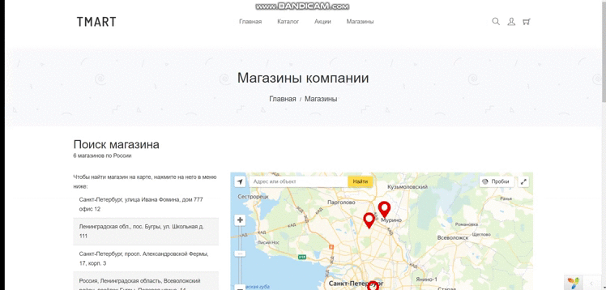
## Category view

## Fitering
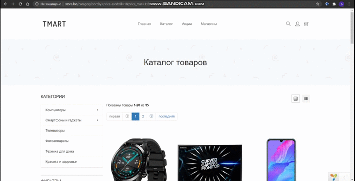
## Short product view
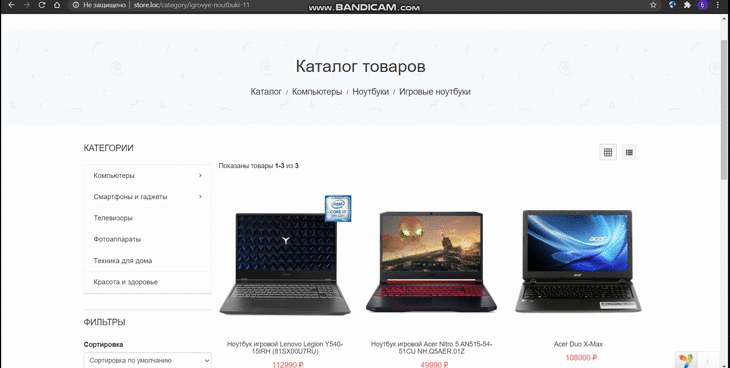
## Product view

## Cart
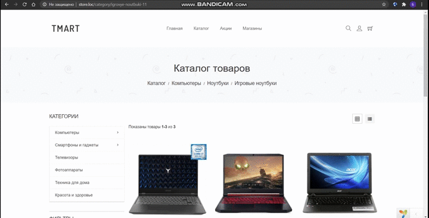
## Order

## Authorisation
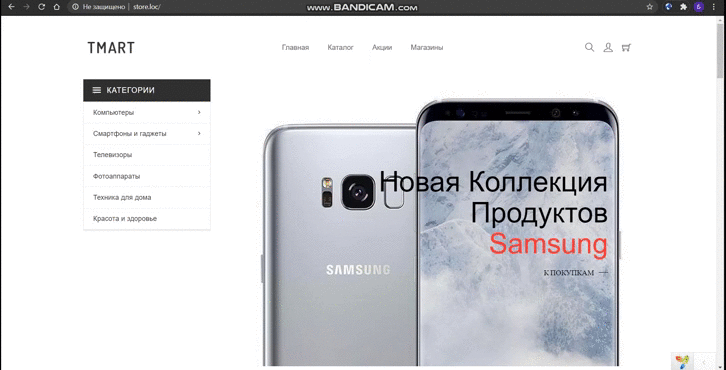
## Main page (admin panel)
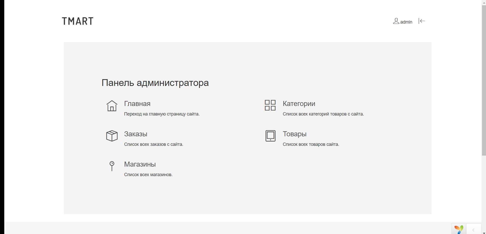
## Categories (admin panel)
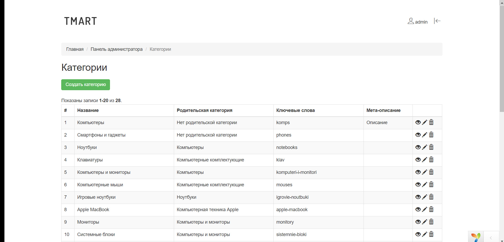
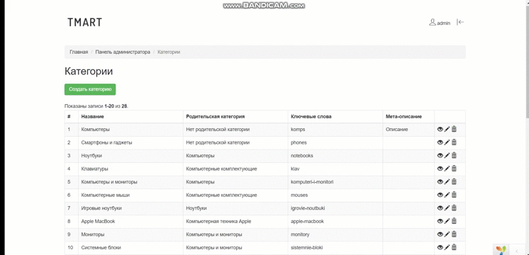
## Products (admin panel)
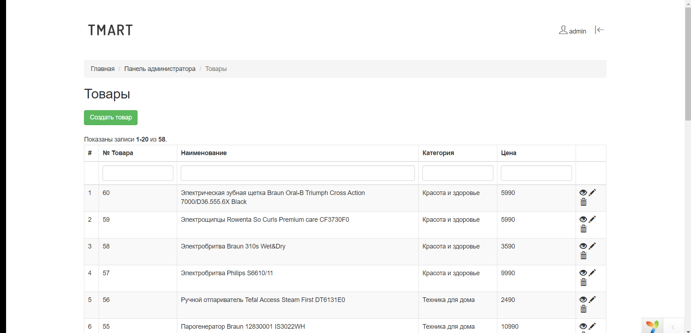
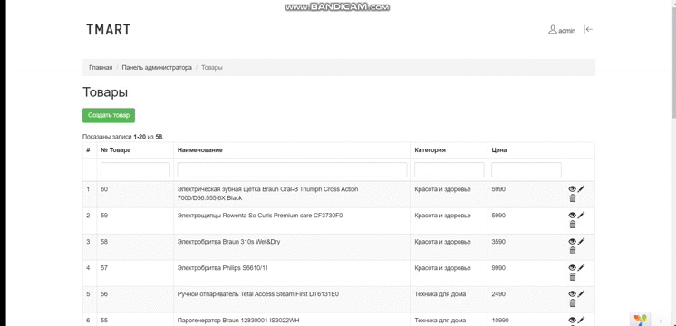
## Orders (admin panel)
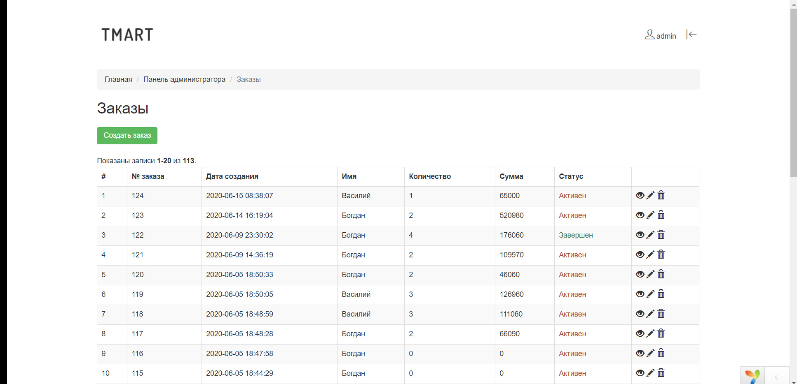
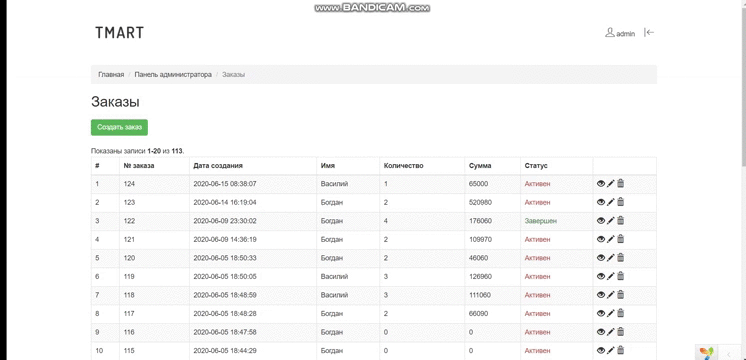
## Officces (admin panel)
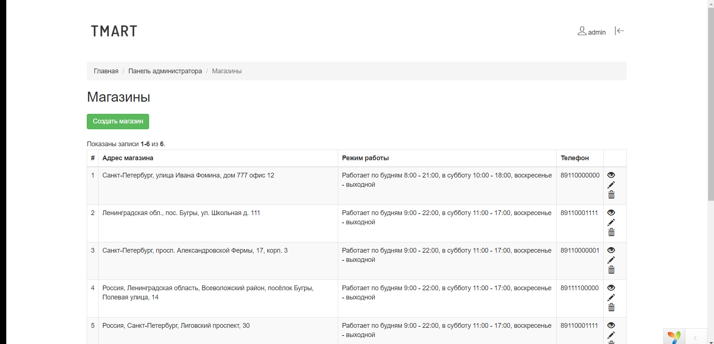

